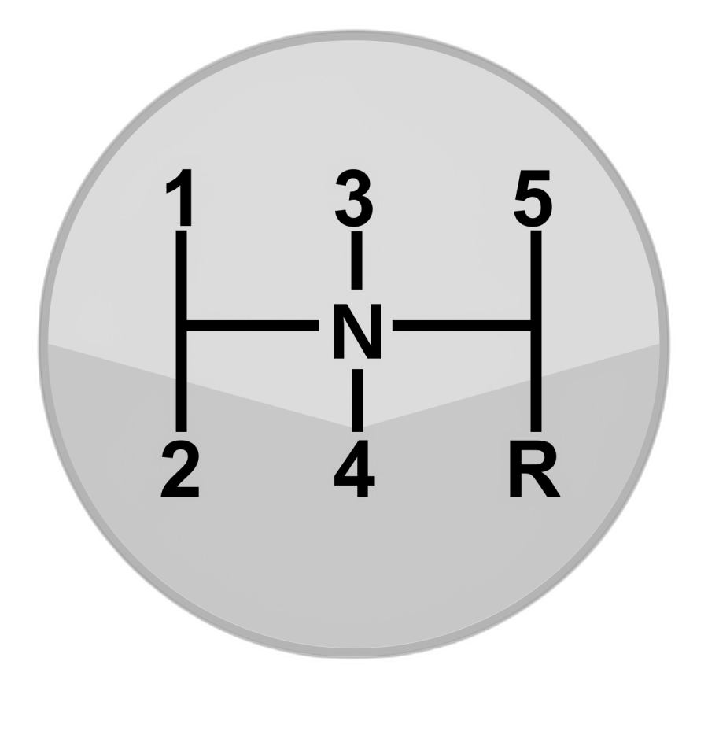
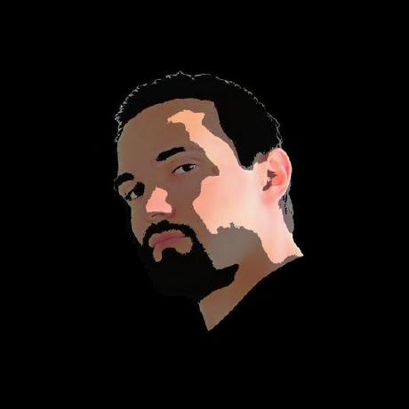
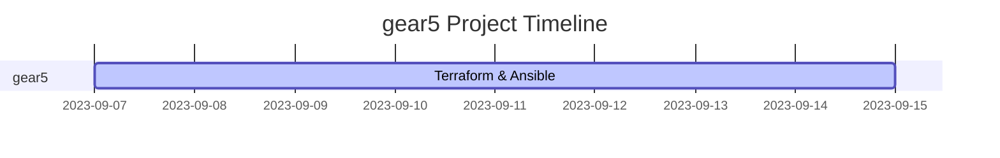

<p align="center">
    
</p>

# *gear*5 - Linux II *Project*

[](https://github.com/SamanPetfat/gear5/actions/workflows/staging.yml)

[](https://github.com/SamanPetfat/gear5/actions/workflows/php_linter.yml)

---

## Team Members

|  |  |  |  |  |  |
| :----------------------------------------------------: | :-----------------------------------------------------: | :---------------------------------------------------------: | :------------------------------------------------------: | :----------------------------------------------------------------: | :---------------------------------------------------: |
|                         GitHub                         |     [Saman Perfat](https://github.com/SamanPetfat)      |       [Martin Alfredson](https://github.com/maal2202)       |     [Pavel Kostyuk](https://github.com/PavelKostyuk)     |        [Fredrik Magnusson](https://github.com/mindriddler)         |     [Alex Roman](https://github.com/AlexRoman777)     |

---

[Description](assignment.md)

[gear5 Trello Board](https://trello.com/b/HF9T6NHr/gear5)

---

<details>
<summary>How to run the project - Old stuff</summary>

## How to run the  - Old stuff

### 0. Prerequisites

- [Docker](https://docs.docker.com/get-docker/)
- [Docker Compose](https://docs.docker.com/compose/install/)
- [Git](https://git-scm.com/downloads)

### 1. Clone the repository

```bash
git clone https://github.com/SamanPetfat/gear5.git
```

### 2. Create the .env file

```bash
cp .env.template .env
```

### 3. Edit the .env file

Add your own values to the .env file, where applicable.

```bash
vim .env # or nano .env
```

Use the same password everywhere for now.

```bash
# Variables för mysql
MYSQL_ROOT_PASSWORD=MYpassword123!            
```

### 4. Run the project

Make sure you are in the gear5 directory.

```bash
cd gear5
```

Start the project. Make sure you have Docker running.

```bash
docker-compose up -d
```

### 5. View the project

Navigate to [http://localhost:8080](http://localhost:8080) in your browser to view the **phpmyadmin** interface.

Navigate to [http://localhost:8000](http://localhost:8000) in your browser to view the **wordpress** site.

### Stop the project

Use `docker-compose stop` to stop the project. This will stop the containers, but not remove them. Later you can start them again with `docker-compose start`.

```bash
docker-compose stop
```

### Remove the project

```bash
docker-compose down -v
```

### Restart the project

```bash
docker-compose start
```

</details>

<details>
<summary>How to run the project - New stuff</summary>

Coming soon...

</details>

---


