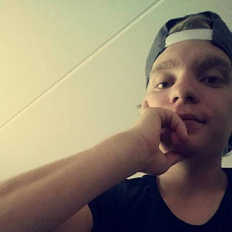

# Team gear5

## Project Description

[Description](assignment.md)

---

## Trello Board

[gear5 Trello Board](https://trello.com/b/HF9T6NHr/gear5)

---

## Team Members

| Name | Role | The Face | GitHub Link |
| --- | --- | :---: | --- |
| Saman Perfat | Team Leader |  | [Saman Perfat](https://github.com/SamanPetfat) |
| Martin Alfredson | Team Member |  | [Martin Alfredson](https://github.com/maal2202)
| Pavel Kostyuk | Team Member |  | [Pavel Kostyuk](https://github.com/PavelKostyuk) |
| Fredrik Magnusson | Tech Lead |  | [Fredrik Magnusson](https://github.com/mindriddler) |
| Alex Roman | Junior Developer |  | [Alex Roman](https://github.com/AlexRoman777) |

---

## TODO

- [x] Create a Trello board
- [x] Create a GitHub repository
- [x] Create a README.md for the project
- [ ] We need to decide on a framework, Wordpress or 'vanilla' PHP
- [ ] Create the docker-compose file
- [ ] Create the .env file (see example.env for reference)
- [ ] Set up .gitignore file - So we don't commit unnecessary files
- [ ] Get a Dev environment up and running
- [ ] Plan about firewall, user management, etc.
- [ ] Plan for backup and restore
- [ ] Plan for monitoring
- [ ] Plan for logging
- [ ] Plan for testing
- [ ] Plan for deployment
- [ ] PDF report
- [ ] Presentation

---
